<div align="center">

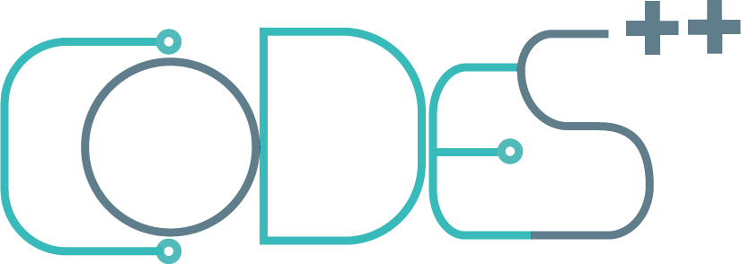

# linkyee — CODES

Página de enlaces (estilo Linktree) del CODES, con recursos y accesos del centro, desplegada con GitHub Pages.

[](../../actions/workflows/build.yml) [](../../actions/workflows/pages/pages-build-deployment)

[**Ver sitio →**](https://codes-unlu.github.io/linkyee/)

</div>

> **Este proyecto es un fork de [linkyee](https://github.com/ZhgChgLi/linkyee)**, creado y mantenido por [ZhgChgLi (Harry Li)](https://zhgchg.li/). Todo el mérito del código base, los temas y los plugins es de su autor original. Esta versión solo adapta la configuración y el contenido para el CODES.

---

## Qué es

linkyee es una página de enlaces de código abierto que se publica en GitHub Pages. Toda la configuración está en un archivo YAML, así que se edita sin tocar HTML. En este fork, el contenido apunta a los recursos del CODES (UNLu).

## Índice

- [Configuración](#configuración)
- [Temas](#temas)
- [Plugins](#plugins)
- [Despliegue en GitHub Pages](#despliegue-en-github-pages)
- [Pruebas locales](#pruebas-locales)
- [Despliegue con Docker](#despliegue-con-docker)
- [Créditos](#créditos)

---

## Configuración

Todo lo que aparece en la página sale de [`config.yml`](./config.yml), un archivo YAML que procesa Liquid:

```yaml
theme: glassmorphism               # carpeta dentro de ./themes/
lang: "es"

plugins:                           # datos opcionales que se obtienen al construir
  - GithubRepoStarsCountPlugin: [ZhgChgLi/linkyee]

title: "CODES - UNLu"              # encabezado del perfil
avatar: "./images/logo.png"
name: "@CODES++"
tagline: "Centro Organizado de Estudiantes de Sistemas de la UNLu."

links:                             # botones de la lista de enlaces
  - link:
      icon: "fa-solid fa-book"
      text: "Wiki del CODES"
      url: "https://wiki.codesunlu.com.ar"
      target: "_blank"

socials: [ ... ]                   # fila de íconos de redes
footer: "HTML libre."
copyright: "© 2026 CODES++."
```

Cada cambio en `config.yml` se publica con un push: GitHub Actions reconstruye el sitio y basta con recargar la página.

### Varios idiomas

Con `i18n` se genera un sitio por idioma. La página raíz elige el idioma guardado o el del navegador, y si no hay coincidencia usa `default_locale`.

```yaml
i18n:
  default_locale: es
  locales:
    es: locales/es.yml
    en: locales/en.yml
```

Cada archivo de idioma sobrescribe el perfil y puede definir etiquetas de la interfaz. Los hashes se combinan con `config.yml`; los arreglos (`links`, `socials`) reemplazan los valores base. Ver [`examples/i18n`](./examples/i18n).

### Reconstrucción diaria

La build corre todos los días a las 00:00 UTC para que los plugins (estrellas, últimas publicaciones, etc.) estén al día. Se configura en [`build.yml`](../../actions/workflows/build.yml) con `schedule:`. Borra ese bloque si no la quieres.

---

## Temas

Hay 8 temas incluidos. Se cambian con una línea en `config.yml`:

```yaml
theme: minimal-mono   # cualquier carpeta dentro de ./themes/
```

| Tema | Claro | Oscuro |
|---|---|---|
| `default` | 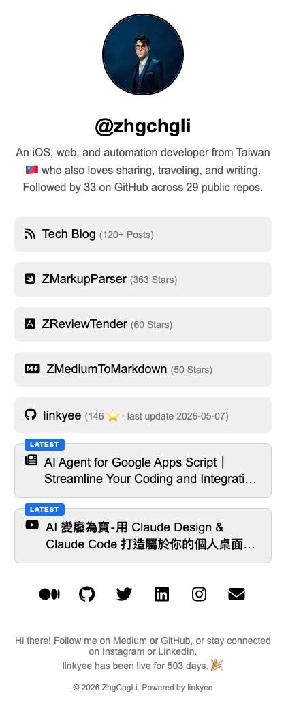 | 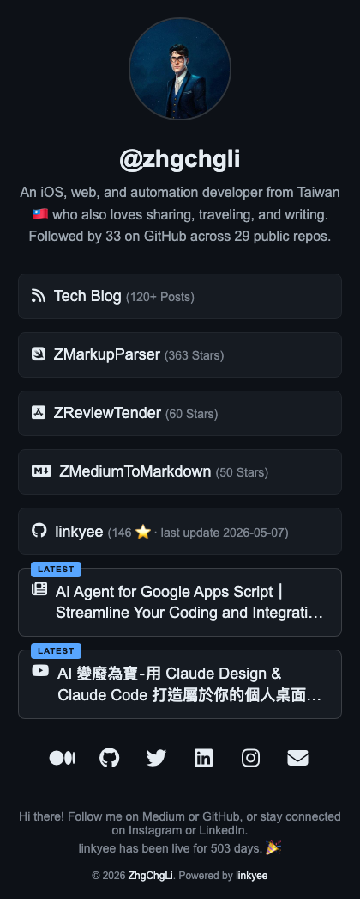 |
| `minimal-mono` | 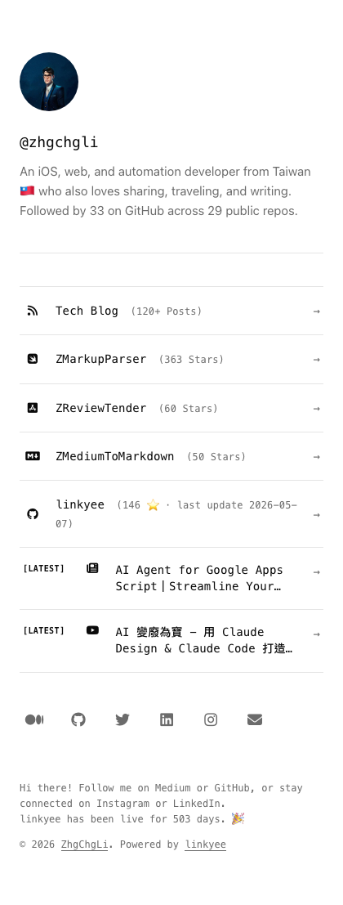 | 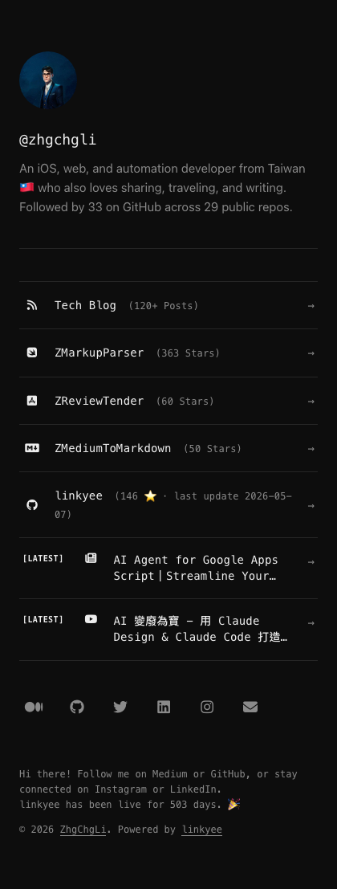 |
| `editorial-serif` | 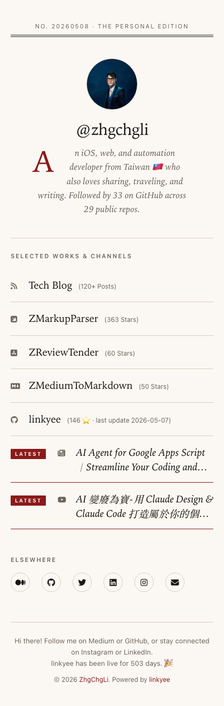 | 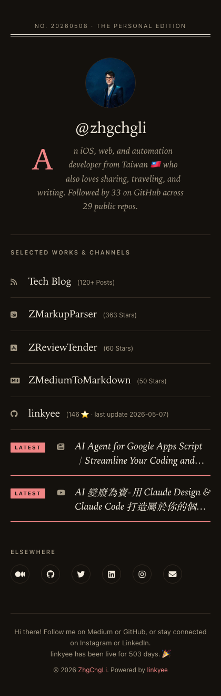 |
| `neo-brutalism` | 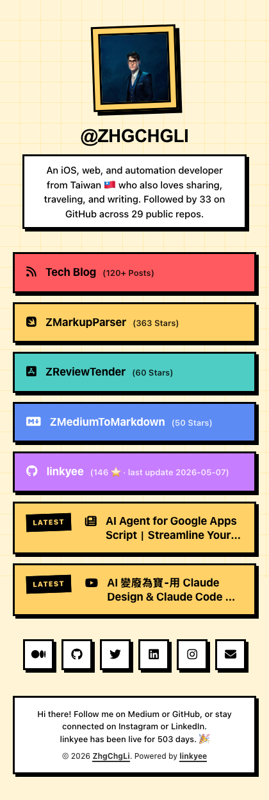 | 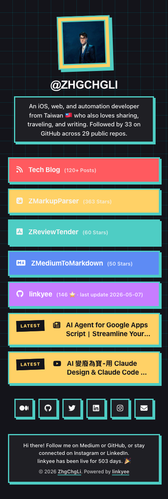 |
| `glassmorphism` | 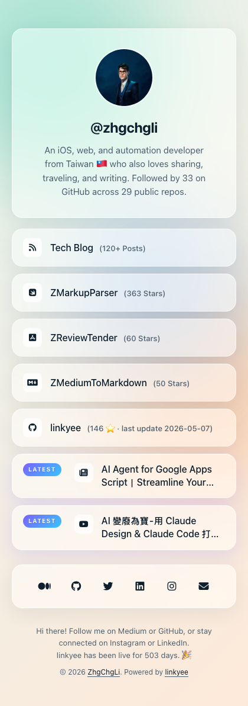 | 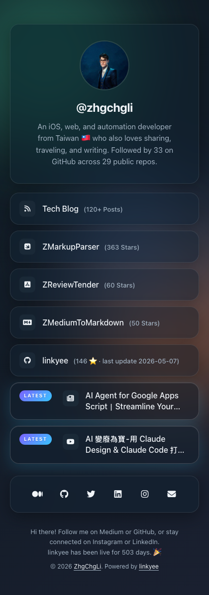 |
| `paper-card` | 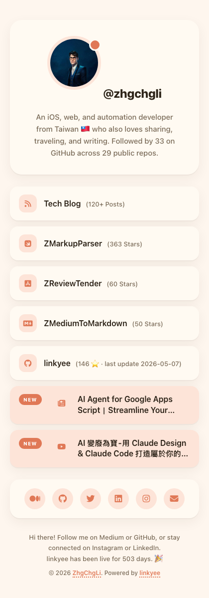 | 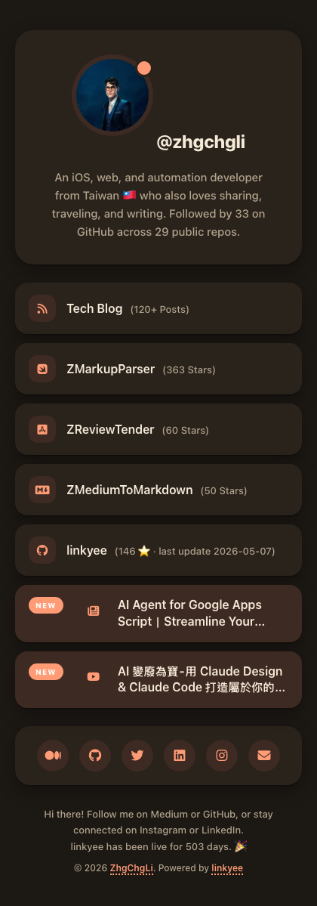 |
| `newsprint` | 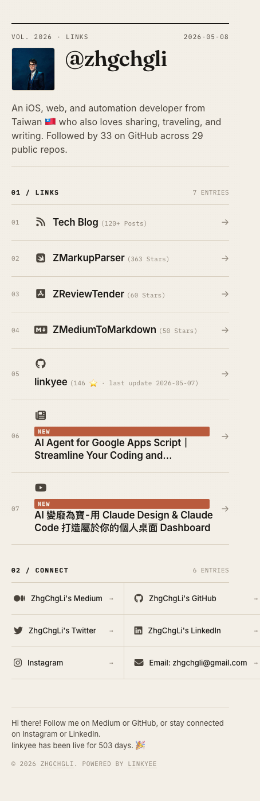 | 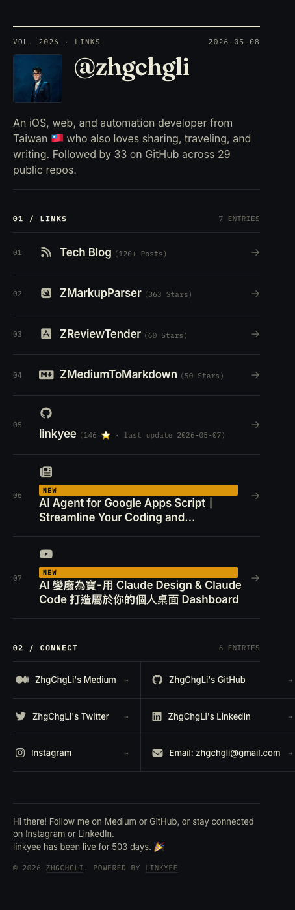 |
| `terminal-retro` | 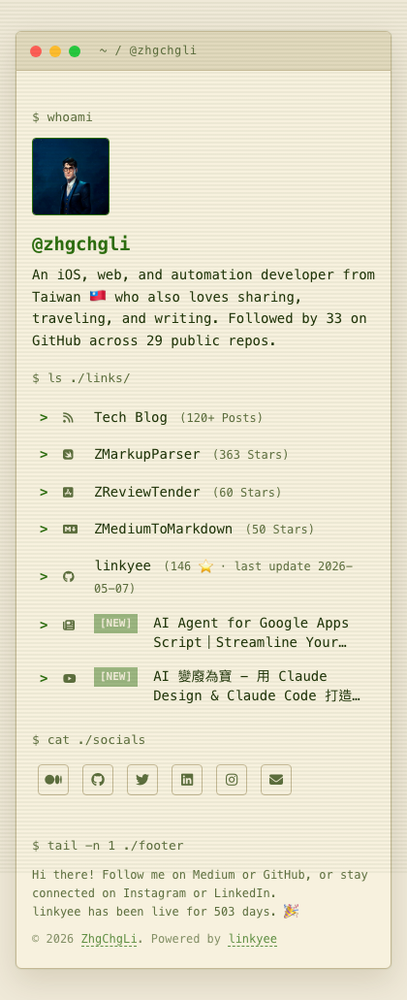 | 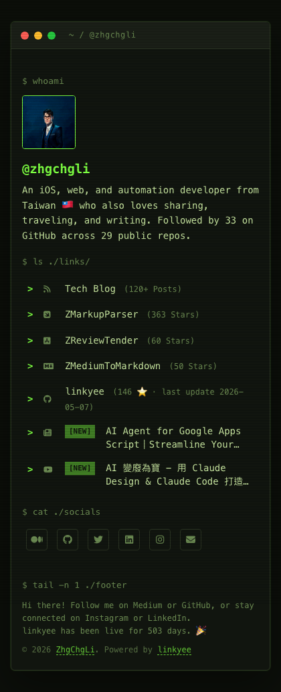 |

El modo oscuro sigue la apariencia del sistema. Para regenerar las capturas después de un cambio visual, ejecuta `./scripts/screenshot-themes.sh` (requiere `npx playwright`).

### Modificar un tema

Cada tema está en `./themes/<nombre>/` con tres archivos: `index.html` (plantilla Liquid), `styles.css` y `scripts.js` (puede estar vacío, pero debe existir).

### Generar un tema con Claude

El repo incluye la skill [`linkyee-style-designer`](./.claude/skills/linkyee-style-designer/SKILL.md) para Claude Code. Describe el estilo que quieres y crea `themes/<tu-tema>/` y lo activa en `config.yml`. Luego puedes probarlo con `./preview.sh <tu-tema>`.

---

## Plugins

Los plugins son clases de Ruby que obtienen datos al construir el sitio y los insertan en la página. Su valor se usa como cualquier texto Liquid.

| Plugin | Qué devuelve | Ejemplo de uso |
|---|---|---|
| `GithubRepoStarsCountPlugin` | Estrellas de uno o más repos | `{{ vars.GithubRepoStarsCountPlugin['dueño/repo'] }}` |
| `GithubLastCommitPlugin` | Último commit: `sha`, `date`, `message` | `{{ vars.GithubLastCommitPlugin['dueño/repo'].date }}` |
| `GithubProfilePlugin` | `followers`, `following`, `repos` | `{{ vars.GithubProfilePlugin['usuario'].followers }}` |
| `RSSFeedPlugin` | Últimas entradas de un feed RSS/Atom | `{{ vars.RSSFeedPlugin['url'][0].title }}` |
| `CountdownPlugin` | Días hasta o desde una fecha | `{{ vars.CountdownPlugin.label.days }}` |
| `YouTubeChannelLatestVideoPlugin` | Último video: título, URL, miniatura | `{{ vars.YouTubeChannelLatestVideoPlugin['@handle'].title }}` |

Para activarlos, agrégalos en `config.yml`:

```yaml
plugins:
  - GithubRepoStarsCountPlugin:
      - ZhgChgLi/linkyee
  - RSSFeedPlugin:
      - https://ejemplo.com/feed.xml
```

Si un plugin falla al construir (red caída, API cambiada, token vencido), la build termina igual: el valor queda vacío y el error aparece en los logs de GitHub Actions.

Para datos que no están en la lista, la skill [`linkyee-plugin-builder`](./.claude/skills/linkyee-plugin-builder/SKILL.md) genera un plugin nuevo. La referencia técnica completa está en [`plugins/README.md`](./plugins/README.md).

---

## Despliegue en GitHub Pages

1. Haz clic en **Use this template** → **Create a new repository** en el repo original de linkyee. Marca **Include all branches**.
2. Si quieres que la URL sea `usuario.github.io`, usa ese nombre para el repo. Si no, la URL será `usuario.github.io/Nombre-del-repo`.
3. En **Settings → Actions → General**:
   - Actions permissions: `Allow all actions and reusable workflows`
   - Workflow permissions: `Read and write permissions`
   - Guarda los cambios.
4. En **Settings → Pages**, elige la rama `gh-pages`.
5. Espera a que termine el primer despliegue en **Actions** y abre la URL que aparece en Pages.

Cada vez que cambies un archivo, espera a que terminen los workflows `Automatic build` y `pages build and deployment`. Después recarga la página.

---

## Pruebas locales

```bash
./preview.sh                    # construye con el tema de config.yml
./preview.sh minimal-mono       # usa otro tema solo en esta sesión (restaura config.yml con Ctrl-C)
PORT=4000 ./preview.sh          # otro puerto (por defecto 8080)
```

`preview.sh` vigila `themes/`, `plugins/`, `config.yml` y `scaffold.rb`, y reconstruye al guardar. Con [`fswatch`](https://github.com/emcrisostomo/fswatch) reacciona más rápido; sin él, revisa cada segundo.

**Requisitos:** Ruby (con `bundle install`) y Python 3, o Ruby, para el servidor local.

---

## Despliegue con Docker

```bash
docker compose up -d --build
```

Escucha en el puerto `8080`. Se puede cambiar con `PORT`, y `REBUILD_INTERVAL` (en segundos) define cada cuánto se reconstruye para actualizar los plugins:

```bash
PORT=8081 REBUILD_INTERVAL=3600 docker compose up -d --build
```

---

## Créditos

- **linkyee** es obra de [ZhgChgLi (Harry Li)](https://zhgchg.li/). Este repo es un fork de su proyecto: [github.com/ZhgChgLi/linkyee](https://github.com/ZhgChgLi/linkyee).
- Adaptación y contenido para el CODES de la UNLu: **CODES++**.

Si te sirvió el proyecto original, puedes apoyar a su autor [aquí](https://www.paypal.com/ncp/payment/CMALMPT8UUTY2).
